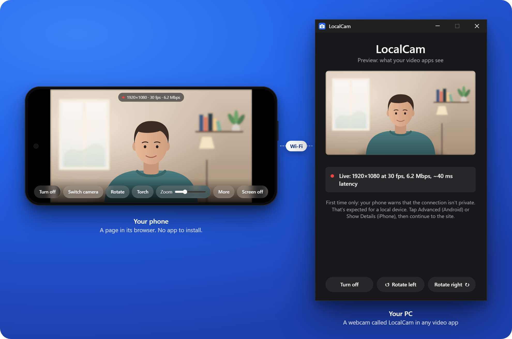

<div align="center">


<h1>LocalCam</h1>

<p><strong>Use your phone as a webcam on Windows.</strong> Turn any iPhone or Android phone into a high-quality webcam<br>
for your PC. No phone app, no account, no cloud. Everything stays on your Wi-Fi, encrypted.</p>

<p>
<a href="https://github.com/donerfolk/LocalCam/releases/latest"></a><br>
<sub>Works with Zoom, Microsoft Teams, Google Meet, Discord, OBS, and any app that uses a webcam.</sub>
</p>

<p>
<a href="https://github.com/donerfolk/LocalCam/actions/workflows/build.yml"></a>
<a href="LICENSE"></a>


<a href="https://buymeacoffee.com/donerfolk"></a>
</p>

<p>
<a href="#setup-3-steps">Setup</a> ·
<a href="#features">Features</a> ·
<a href="#troubleshooting">Troubleshooting</a> ·
<a href="#comparison">Comparison</a> ·
<a href="#build-from-source">Build from source</a>
</p>



</div>

```
Phone browser                              Windows PC (LocalCam.exe)
┌───────────────────────────┐  Wi-Fi  ┌──────────────────────────────────────────┐
│ getUserMedia (camera)     │         │ HTTPS server: serves the phone page      │
│ → WebCodecs H.264 encode  │──WSS──▶ │ → Media Foundation H.264 decode          │
│   (phone hardware)        │         │ → softcam virtual camera ("LocalCam")    │
└───────────────────────────┘         └──────────────────────────────────────────┘
                                                        │
                                  Zoom / Teams / Discord / OBS / Chrome see "LocalCam"
```

## Why LocalCam

Most "use phone as webcam" solutions require installing an app on the phone, creating an account, or routing video through a cloud server. LocalCam is different:

- **No phone app.** The phone opens a page in its browser. Nothing to install.
- **No account.** Scan the QR code and you're streaming.
- **No cloud.** Video travels directly from the phone to the PC over your Wi-Fi, encrypted with TLS.
- **No ads, no subscription.** Free and open source (MIT).
- **Low latency.** The phone encodes H.264 in its browser and the PC decodes it with the decoder built into Windows, with no server in between. The PC window shows the live latency for encoding, Wi-Fi and decoding, which averages 30 to 90 ms in testing.
- **High quality.** 720p or 1080p, at 30 or 60 fps where the phone's camera supports it.

## Requirements

- **PC:** Windows 10 or 11
- **Phone:** Chrome on Android, or Safari on iOS 16.4 or later
- **Network:** Phone and PC must be on the same Wi-Fi network

## Setup (3 steps)

1. **Install and run LocalCam.** It shows a QR code. (The installer isn't code-signed yet, so Windows may warn **Windows protected your PC**. Click **More info → Run anyway**.)
2. **Scan the QR code** with your phone's camera. The camera page opens in the browser.
3. **Allow camera access.** Pick **LocalCam** as the camera in your video app.

The first time, the phone browser warns that the connection isn't private. That's expected for a local server with no domain name. Tap **Advanced → Proceed** (Chrome) or **Show Details → visit this website** (Safari). Bookmark the page to skip the QR code next time.

Keep the phone's browser open and unlocked. Tap **Screen off** to black out the display and save battery while the camera keeps streaming.

## Features

**Phone controls**
- Switch front / back camera
- Flashlight / torch toggle
- Zoom slider (per-camera, remembered)
- Lens picker (ultra-wide, telephoto; where the browser supports it)
- Manual focus with auto-focus toggle
- Exposure compensation
- Exposure and white balance lock
- Rotate
- Screen off (streams with display dark)
- Live frame rate and bitrate display
- Adaptive bitrate, drops automatically when Wi-Fi can't keep up

**PC window and tray**
- Live preview of what video apps see
- Camera on / off
- Rotate and mirror
- Resolution: 720p or 1080p
- Aspect ratio: 16:9, 4:3, or portrait 9:16
- Frame rate: 30 or 60 fps
- Quality: low / normal / high
- Start with Windows
- Copy the phone link
- New pairing code (old links stop working)
- Select network adapter (useful on PCs with multiple adapters)

## Privacy and Security

Video goes directly from the phone to the PC over TLS (HTTPS/WSS). Nothing leaves your network, and there is no account or cloud service.

The QR code holds a link with a random pairing code. Other devices on your Wi-Fi can open the page, but the PC refuses video from anything that doesn't have the code. The self-signed certificate and its key are stored in your Windows user's certificate store. Full protocol details: [docs/PROTOCOL.md](docs/PROTOCOL.md).

**Known limits**
- The pairing code is part of the link, so it's also in the phone's browser history and bookmarks. Anyone with the link can stream to your PC while they're on your network. If a link got out, choose **New pairing code** in the tray menu and every old link stops working.
- The certificate is self-signed, so the phone warns about it the first time. Someone who controls your network at that moment could pose as your PC and learn the pairing code. Pair on a network you trust, and if the warning comes back unexpectedly, don't continue.
- The installer's firewall rule accepts connections from the PC's own subnets on every network, public Wi-Fi included. On a network you don't trust, quit LocalCam (tray icon → **Exit**).
- LocalCam is made for a home or office network. Never forward its port to the internet. To use it away from home, put the phone and the PC on a VPN such as Tailscale.
- The installer isn't code-signed yet.

## Troubleshooting

**The phone can't reach the PC.**  
Both must be on the same Wi-Fi with no VPN active. Guest networks and some office networks block device-to-device traffic. If the PC has multiple network adapters (VPN adapter, Hyper-V, WSL), choose the right one under tray icon → **PC address**. The installer adds a Windows Firewall rule automatically; if you run LocalCam without installing it, allow it when Windows prompts.

**LocalCam doesn't appear in Zoom, Teams, or Discord.**  
Restart the video app after starting LocalCam. If the app was already running, it may not detect the new camera until it restarts.

**LocalCam doesn't appear in the Windows Camera app.**  
LocalCam is a DirectShow virtual camera. The Windows Camera app only lists Media Foundation cameras and can't see DirectShow cameras. Zoom, Teams, Google Meet, Discord, OBS, and most browsers use DirectShow and will see it.

**A second phone took over.**  
Only one phone streams at a time. The displaced phone shows a **Use this phone** button to take back the stream.

**Start over with pairing.**  
Choose **New pairing code** in the tray menu. The phone streaming now disconnects, and all existing QR codes, links and bookmarks stop working. Scan the new QR code.

## Comparison

| | LocalCam | DroidCam | EpocCam | Camo |
|---|---|---|---|---|
| Phone app required | No | Yes | Yes | Yes |
| iPhone support | Yes | Yes | Yes | Yes |
| Android support | Yes | Yes | No | Yes |
| Cloud routing | No | No | No | No |
| Free | Yes | Free tier | Free tier | Free tier |
| Open source | Yes (MIT) | No | No | No |
| Max resolution (free) | 1080p | 480p | 480p, watermark | 720p, watermark |
| Still developed | Yes | Yes | No (discontinued) | Yes |

## Build from Source

Visual Studio 2022 (Desktop C++ workload) and CMake 3.21+.

```bash
cmake -S desktop -B build -A x64
cmake --build build --config Release
ctest --test-dir build -C Release
```

The output is `build/bin/Release/LocalCam.exe`. On first run it registers `softcam.dll` (in the same folder) as the virtual camera for the current user. No administrator rights required.

**Debug options**
- `LocalCam.exe 2> log.txt`: write logs to a file
- `LocalCam.exe --dump stream.h264`: save the raw H.264 stream from the phone (plays in VLC or `ffplay`)
- `LocalCam.exe --tray`: start directly to the tray without showing the window
- Add `&compat` to the phone page URL to force the Safari code paths, for testing in a desktop browser

**Installer**  
The installer (`installer/LocalCam.iss`, [Inno Setup](https://jrsoftware.org/isinfo.php) 6) also needs the 32-bit camera DLL for 32-bit video apps:
```bash
cmake -S desktop -B build32 -A Win32
cmake --build build32 --config Release --target softcam
```

The [GitHub Actions workflow](.github/workflows/build.yml) builds both, signs the files on a `v*` tag (when a certificate is configured), publishes a GitHub Release, and updates the winget package.

## How It Works

LocalCam avoids WebRTC to keep the implementation small and the protocol transparent. Instead:

1. The phone browser uses `getUserMedia` to open the camera and `VideoEncoder` (WebCodecs API) to encode frames in H.264 using the phone's hardware encoder.
2. Each encoded frame is sent as a binary WebSocket message over a TLS-encrypted connection to a server running inside LocalCam.exe on the PC.
3. LocalCam decodes the H.264 stream using Windows Media Foundation (built into Windows, no FFmpeg dependency) and writes decoded frames into a DirectShow virtual camera powered by [softcam](https://github.com/tshino/softcam).
4. Video apps see "LocalCam" as a standard webcam.

## License

MIT. Includes [softcam](https://github.com/tshino/softcam) (MIT) and [QR Code generator](https://github.com/nayuki/QR-Code-generator) (MIT).
